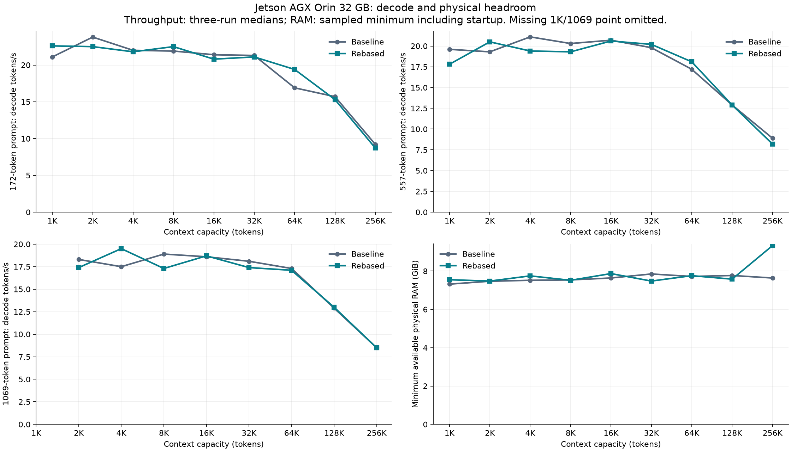
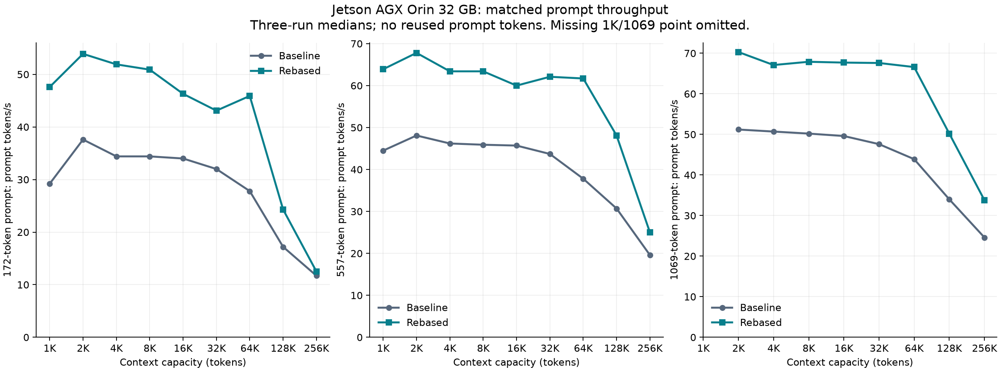
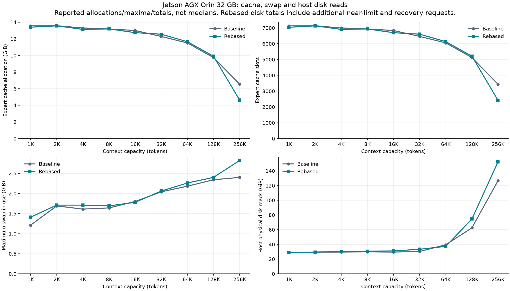

# Jetson AGX Orin validation, 2026-10-08

Hardware: Jetson AGX Orin Developer Kit 32 GB, ARM64, JetPack 6.2,
CUDA 12.6.68, GCC 11.4, SM87. Power mode is MAXN; clocks were not locked.
The user stopped their separate ninfer service before these runs.
Source baseline: `d5ea7133741e67743c0e886bb426c0ce8d69cf6c`, with the
uncommitted `feat/jetson-orin-arm64` changes. Installed engine version
0.1.40.3, engine source fingerprint `71ddb783ff5dddc8`, vision fingerprint
`bccffef4afd95604`; [build metadata](BUILD.json) preserves these values.

Model: ISTA-DASLab/Qwen3.8-Flash-Next-GSQ-RCO-Coder-GGUF, IQ1_M,
revision `5348543e0147355ac9cbcb031184a3546350988e`.
Both shards were checked against their pinned SHA256 values. The expert pack
is file-backed (23.42 GiB); canonical dense weights occupy 1.37 GiB.
MTP uses all 31 verified tensors from revision
`de4b8e4d43b917e7706784d8bb445c9af86a3540`, prepared as Q2_0 experts.

## Findings and fixes

A one-token native CLI prompt originally exited successfully without producing
a token because position zero was also the sentinel for skipping execution.
Using -1 as the sentinel fixes this. [Before](single-token-before-fix.txt)
and [after](single-token-after-fix.txt) runs preserve the evidence.

The first MTP API request originally reduced available RAM below the default
six GiB headroom. Auto cache sizing now leaves a separate three GiB reserve
for late prompt/verification/CUDA workspace on integrated devices, and startup
checks available physical RAM after initialization. Explicit reserve settings
remain user-controlled. This is a sizing heuristic and a point-in-time check;
it cannot prevent another process from allocating RAM afterwards.

The corrected API server allocated 13.39 GiB to 7,036 cached experts.
[Seven API checks](api-validation-workspace.json) passed: repeated greedy
requests, OpenAI and Anthropic streaming, and recovery after cancellation
during decode and prefill. All listeners used `127.0.0.1:18081`.

## Repeated throughput

[Raw responses](benchmark-4k.json) and [timings](benchmark-4k.txt) record
three requests at each prompt size, with 64 generated tokens each, MTP spec 4,
prefill batch 64 and context limit 4096. No prompt tokens were reused.

| Prompt tokens | Median prompt tokens/s | Median decode tokens/s |
| --- | --- | --- |
| 172 | 37.8 | 21.6 |
| 557 | 47.9 | 19.7 |
| 1069 | 52.5 | 18.6 |

Across the corrected API checks, benchmarks and 3105-token context request,
[one-second samples](api-workspace-samples.jsonl) show at least 7.43 GiB
available physical RAM. Swap usage reached 1.58 GiB; this was not a swap-free
run. RSS alone omits GPU allocations, so the report uses system available RAM.
The [3105-token prompt](context-4k.json) returned the expected `OK` with
56.2 prompt tokens/s; its two-token decode is not a throughput benchmark.

## CPU reference

For the explicit input token 248045, the actual CPU llama.cpp reference and
Strata both selected token 846. All 248,320 logits were finite.
[Recorded differences](first-logit-comparison.json) include RMS logit error
0.01759, selected-token log probability difference 0.00000893 and
KL(reference || Strata) 8.39e-8. This tests one position, not all prompts.
Use the pinned [reference helper](../2026-10-07-jetson-orin/reference_logits.cpp)
and `STRATA_DUMP_FIRST_LOGITS=OUTPUT` with Strata `--tokens`, `--max-new 1`,
`--prefill 1`. Compare the last headered reference row with the raw FP32
Strata row. Native packs do not implement `--dump-logits`.

The [7234-token prompt](context-8k.json) passed at context limit 8192,
returning `OK` at 49.7 prompt tokens/s. [Samples](memory-8k.jsonl) include
startup and this request.

The [15 Jetson setup cases](setup-jetson.txt) and
[seven built ARM CPU tests](cpu-selected-tests.txt) passed. An unrestricted
[CTest invocation](cpu-tests.txt) was unsuitable for this partial build:
15 target executables were absent and the expert parity target expected a
model file at `pack/full/experts.bin`. Its failure is not counted as a passing
suite. Earlier explicit real-expert parity results remain in the October 7
report. The [desktop setup regression suite](setup-desktop.txt) also passed 110 cases.

The installed configurations are preserved alongside the results. Start the
MTP server with `.venv/bin/python -m serve.server --engine strata --config`
followed by the absolute path to `strata-orin-validation-mtp.json`, and
`--host 127.0.0.1 --port 18081`. Run `validate_api.py --out OUTPUT` then
`benchmark_api.py --out OUTPUT`. Use `monitor_memory.py --config CONFIG
--out OUTPUT` while the server runs. Paths in the configurations identify the
verified prepared artifacts; substitute equivalent paths on another host.

The [31234-token prompt](context-32k.json) passed at context limit 32768,
returning `OK` after 584 seconds of prefill (53.5 tokens/s). A subsequent
[short request](recovery-32k.json) also passed. The 32K cache contained 6598
experts (12.55 GiB). [Memory samples](memory-32k.jsonl) cover startup, the long
prompt and recovery: minimum available RAM 7.33 GiB, maximum system RAM in use
22.65 GiB, maximum process-tree RSS 9.28 GiB, maximum swap in use 0.99 GiB.
Host-wide physical disk reads increased by 26.82 GiB over this window; this
includes startup and unrelated host activity. Engine expert-read counters are
logical reads and do not measure physical storage traffic.
At context 8192, the corresponding sampled minimum was 7.48 GiB available
RAM and host-wide reads increased by 18.65 GiB across startup and the request.

GPU temperatures during the 32K window ranged from 48.3 to 57.8 degrees C
in [one-second tegrastats samples](tegrastats-32k.txt). These temperatures
do not establish sustained throughput after thermal equilibrium.

For [two- and four-token inputs](reference-comparison.json), the CPU reference
and both Strata prompt paths selected token 248046, but log probabilities
were substantially different: KL(reference || Strata) was 0.356–1.118.
For four tokens the selected-token log probability differed by 0.983–1.005.
These are observations, not numerical-parity passes. For the model's
[formatted 19-token chat prompt](reference-chat-prompt.json),
[both prompt paths](reference-chat-comparison.json) selected token 9419
(`Hello`), matching the CPU reference. The selected-token log probability
differed by 0.00036–0.00038 and KL was 3.45e-5–3.86e-5. Logit RMS differences
were 0.158–0.168. This establishes agreement for the tested prompt, not a
universal numerical tolerance or parity for every sequence. The raw-token
discrepancy remains documented and has not been attributed to ARM versus
existing engine approximations without a desktop reference run.

## Vision

The verified BF16 projector encoded the same 56-by-56 fixture on CPU and CUDA.
[Both outputs](vision-comparison.json) had 16 tokens, a 4-by-4 grid and width
2560, with all values finite. Cosine similarity was 0.99989; relative RMS
error was 0.01484. Reported encoding times were 6964 ms on CPU and 28 ms on
CUDA. Whole-process times including startup/warmup were 8.69 and 3.48 seconds.
These measurements concern this fixture and a 16-token encoder cap.

The [image API request](image-api.json) generated 48 tokens describing the
colored checkerboard and gradient. The [repeated request](image-api-repeat.json)
returned identical text with 34 cached prompt tokens. The encoder loaded before
cache sizing; the cache held 6428 experts (12.22 GiB). Across startup and both
requests, [memory samples](memory-vision.jsonl) retained at least 7.38 GiB
available RAM, with peak system use 22.60 GiB and swap use 1.29 GiB.
This does not validate high-resolution images or the default encoder token cap.
Run `validate_vision.py` with the prepared paths, then use the saved
`strata-orin-validation-vision.json` server configuration and
`validate_image_api.py`. The validation server was stopped after the tests.

## Small performance comparisons

[The CPU row benchmark](cpu_rows.cpp) compares portable Q2 rows and pinned
ggml's ARM backend over 256 rows, width 2560 and three tokens, with 20 timed
iterations after warmup. [Mean times](cpu-rows.txt) were 2.303 ms and 0.323 ms.
They use different Q8_1/Q8_0 activation contracts; outputs were finite with
relative RMS difference 0.00020. This is not an end-to-end expert benchmark or
permission to substitute activation contracts. Existing CPU correctness tests
check each contract independently. Build with the pinned ggml include directory,
`libstrata_kernels_cpu.a`, `libggml-cpu.a`, `libggml-base.a`, OpenMP and pthread.

[The memory benchmark](memory_paths.cu) fills a 64 MiB buffer on the CPU,
then measures upload (where needed), GPU checksum and synchronization. CPU fill
is excluded. After three warmups, ten iterations produced these
[median times](memory-paths.txt), all with exact checksums:

| Sequential path | Median ms |
| --- | --- |
| Pinned host copy to device | 13.169 |
| Mapped host GPU read | 5.345 |
| Managed allocation | 5.754 |

Compile with `/usr/local/cuda-12/bin/nvcc -O2 -arch=sm_87` and run with the
model stopped. The managed test transfers ownership only after device
synchronization. Orin lacks concurrent managed access; these timings do not
justify managed allocations for concurrently polled control buffers, or replacing
the expert-cache policy. No new custom NEON or managed-memory optimization was
enabled from these microbenchmarks.

## Tested scope and limits

The port is validated for the pinned Coder IQ1_M pack on this Orin, with
file-backed experts, auto cache, prefill 64, MTP spec 4, context limits up to
32768 and six GiB physical headroom plus three GiB late-workspace reserve.
Model preparation and local source builds preserve JetPack's CUDA libraries.
Windows, HIP and other model variants were not run on this host. Desktop setup
regressions and x86 CPU cross-builds passed; this is not desktop GPU validation.
The raw-token numerical differences above remain a limit on parity claims.
No process-independent RAM reservation or sustained thermal benchmark is claimed.
The validation processes are stopped; the user's ninfer service remains inactive.

## Rebase onto upstream 0.1.41

The fork was synchronized with upstream `fb58e0dbc8399662c0e47c76578c6e878b14f6cf`
and the Orin changes rebased onto it. The original measured port commit
`c32492c107ecbf4db7d22f81533ef72a86e7dd2d` and its installed binary were preserved
for a same-day comparison. The rebased port is `866a5d8`; ARM test portability
and the sweep harness are recorded in `982bc98`. The
[new build metadata](rebased-validation/BUILD.json) records engine version
0.1.41 and source fingerprint `287a6501f960f3c9`. Vision's source fingerprint
is unchanged.

The full Release CUDA build targeting SM87 passed. The
[initial CTest run](rebased-validation/ctest.txt) exposed four failures and
three fixture/architecture skips. After corrections,
[six targeted checks](rebased-validation/final-tests.txt) passed, giving
102 passing eligible cases across the initial run and targeted rerun.
The legacy `expert_parity`, `pool_test`, and `ple_parity` tests require their
original model/block fixtures and are not counted as passing. Actual Coder
[native expert checks across all 48 layers](rebased-validation/coder-parity.txt)
passed independently. [Seven real-model API checks](rebased-validation/api.json)
also passed, including streaming and recovery after prefill/decode cancellation.

The test changes preserve the GPU kernels: the Q8_K CPU reference explicitly
rounds its intermediate FP32 multiplication before the magic-number rounding
step, avoiding ARM compiler contraction. The expert multi-test runs on ARM
instead of requiring x86 AVX-512. VMM and segmented-cache tests retain mapping,
data, and allocation state checks on integrated devices, but record global
free-memory changes as observations rather than equating them with individual
GPU allocations; strict free-VRAM delta assertions remain on discrete GPUs.

[Jetson setup](rebased-validation/setup-jetson.txt) passed 15 cases;
[desktop setup](rebased-validation/setup-desktop.txt) passed 111 cases.
The [x86 CPU/router cross-build](rebased-validation/x86-build.txt) passed.
[HIP](rebased-validation/hip-unavailable.txt) and
[SYCL](rebased-validation/sycl-unavailable.txt) configure attempts confirmed
that their toolchains are unavailable on the Orin. Subsequent full Release
HIP (gfx1100, MMQ and tests enabled) and SYCL (SPIR-V, parity targets enabled)
builds passed on the x86-64 Ubuntu host `maestro1`, using AMD TheRock
`7.10.0a20251120` and Intel DPC++ 2026.1.1 with oneMKL 2026.1.0. Both binaries
loaded and printed help. The [backend build report](../2026-10-08-maestro1-builds/README.md)
records commands, compiler versions, complete logs and CPU/setup test
exclusions. HIP/SYCL model execution and desktop GPU runtime remain untested;
these builds do not extend the Orin performance results to other hardware.

### Parametric context comparison

The [sweep script](context_sweep.py) tests context capacities 1024, 2048, 4096,
8192, 16384, 32768, 65536, 131072, and 262144. Each engine starts a fresh
loopback server per capacity. It uses auto expert-cache sizing, file-backed
experts, prefill batch 64, MTP spec 4, greedy decoding, and disabled thinking.
The installed configurations and binary SHA256 values are saved with each cell.
No KV streaming override is enabled. These runs use the same pinned model,
prepared packs and draft vocabulary described above.

Three matched requests per prompt size generate up to 64 tokens at each
capacity (the 1069-token prompt is omitted at 1024). The round/size prefix
changes between requests; reused prefix counts are preserved in the API
responses. There is no separate warm-up. OS file caches are retained, expert
caches warm within each server session, and server order alternates between
capacities. Model loading is excluded from request timings but included in
one-second physical-memory and host-disk samples. Output text and draft
acceptance are preserved because changes in these affect throughput.

The rebased engine additionally receives one near-limit prompt per capacity,
with approximately 256 tokens of margin and a 64-token output cap, followed
by a short exact-`OK` recovery check. These long-prompt numbers are single runs,
not three-run medians or long-context recall accuracy checks. The 6 GiB
physical headroom target is retained; a cell that crosses it is explicitly
marked, even if inference completes. Swap is not included in the RAM budget.
The monitor stops a server after five consecutive samples below 2 GiB available.
The model's native 256K window is not a guarantee that this hardware can run it.


All 18 engine/capacity cells passed and preserved the six GiB headroom target.
There were 156 matched throughput requests, nine near-limit throughput requests
and nine exact-`OK` recovery checks. Every throughput request generated 64
tokens; every request reported zero reused prompt tokens. Decode entries below
are medians with minimum–maximum ranges for the three matched runs. Near-limit
entries are single runs. The 256K prompt read 261,936 tokens in 4,480.2 seconds
(74.7 minutes) and generated 64 tokens in 9.75 seconds; total client latency
was 4,490.3 seconds. It preserved at least 9.33 GiB available physical RAM.

These results establish successful execution for this model and configuration,
not recall accuracy or numerical equivalence across the whole model window.
Longer capacities reduce the automatic expert cache and decode throughput.
At 256K, the baseline received 3,435 slots (6.55 GiB), while the rebased engine
received 2,421 (4.64 GiB). Their starting OS available-memory snapshots were
24.83 and 24.84 GiB, respectively; engine-reported free budgets differed.
Cache allocation was not held fixed, so throughput differences are observations
of each build's automatic configuration, not isolated kernel comparisons.
The largest-context result does not justify changing the 32K Jetson starter
recommendation for short-request throughput.

GPU temperature across [one-second telemetry](rebased-context-sweep/tegrastats.txt)
ranged from 43.0 to 65.9 degrees C. Clocks were not locked. Two brief HIP/SYCL
compiler configuration probes ran during the 256K long prompt and failed for
missing toolchains; no build ran concurrently with the measured requests.
Swap was in use. Host-wide physical disk reads include loading and other host
activity and are distinct from logical expert-read counters. Baseline cells
contain the matched short requests; rebased cells additionally contain the
long prompt and recovery, so their disk totals cover different work.

The [raw matrix](rebased-context-sweep/matrix.json) and per-cell directories
preserve every response, launch configuration, engine/server log, binary hash
and physical-memory sample. The measured local commit identifiers precede
publication of the report; the engine source fingerprints in BUILD.json
identify the compiled source independently of report-only commit changes.



The throughput panels use the three-run medians below. The RAM panel uses the
sampled minimum, including startup. The 1069-token prompt is absent at 1K.
Near-limit requests have no baseline counterpart and are not plotted.

| Context | Engine | Status | Min available GiB | 172-token decode/s | 557-token decode/s | 1069-token decode/s | Near-limit prompt tokens / prompt/s / decode/s |
| --- | --- | --- | --- | --- | --- | --- | --- |
| 1024 | baseline | passed | 7.32 | 21.1 (14.0–22.4) | 19.6 (19.3–20.5) | — | — |
| 1024 | rebased | passed | 7.55 | 22.6 (13.1–23.8) | 17.8 (17.8–22.5) | — | 814 / 66.2 / 19.6 |
| 2048 | baseline | passed | 7.47 | 23.8 (13.8–24.3) | 19.3 (18.9–20.7) | 18.3 (15.7–19.4) | — |
| 2048 | rebased | passed | 7.48 | 22.5 (13.8–23.7) | 20.5 (18.4–21.5) | 17.4 (16.4–18.3) | 1838 / 70.2 / 21.2 |
| 4096 | baseline | passed | 7.52 | 22.0 (14.7–24.6) | 21.1 (18.2–21.2) | 17.5 (14.9–19.7) | — |
| 4096 | rebased | passed | 7.75 | 21.8 (14.8–22.7) | 19.4 (19.0–19.5) | 19.5 (18.5–22.5) | 3886 / 72.0 / 22.9 |
| 8192 | baseline | passed | 7.54 | 21.9 (14.1–22.3) | 20.3 (18.9–20.6) | 18.9 (15.6–19.8) | — |
| 8192 | rebased | passed | 7.52 | 22.5 (14.7–22.9) | 19.3 (19.0–21.2) | 17.3 (17.1–18.1) | 7983 / 71.8 / 20.8 |
| 16384 | baseline | passed | 7.64 | 21.4 (13.9–21.8) | 20.7 (19.8–21.9) | 18.6 (16.8–21.8) | — |
| 16384 | rebased | passed | 7.87 | 20.8 (13.2–22.1) | 20.6 (17.6–20.8) | 18.7 (17.4–23.3) | 16175 / 72.8 / 19.0 |
| 32768 | baseline | passed | 7.85 | 21.3 (12.9–21.9) | 19.8 (19.5–20.1) | 18.1 (17.1–19.6) | — |
| 32768 | rebased | passed | 7.48 | 21.1 (13.1–23.7) | 20.2 (18.6–21.3) | 17.4 (16.5–21.3) | 32559 / 73.6 / 17.1 |
| 65536 | baseline | passed | 7.72 | 16.9 (12.6–18.3) | 17.2 (15.8–19.0) | 17.3 (16.6–17.7) | — |
| 65536 | rebased | passed | 7.76 | 19.4 (10.7–22.8) | 18.1 (18.0–22.4) | 17.1 (16.9–17.1) | 65328 / 72.5 / 14.2 |
| 131072 | baseline | passed | 7.77 | 15.7 (10.4–17.5) | 12.9 (12.5–15.8) | 12.9 (11.9–13.4) | — |
| 131072 | rebased | passed | 7.58 | 15.3 (10.1–16.4) | 12.9 (12.1–13.5) | 13.0 (12.3–13.2) | 130864 / 69.3 / 11.7 |
| 262144 | baseline | passed | 7.64 | 9.2 (7.0–9.9) | 8.9 (8.6–9.4) | 8.5 (7.9–9.2) | — |
| 262144 | rebased | passed | 9.33 | 8.7 (6.9–9.2) | 8.2 (8.2–9.5) | 8.5 (7.3–8.6) | 261936 / 58.5 / 6.6 |

Matched prompt throughput: median (minimum–maximum), three runs per size.



| Context | Engine | 172-token prompt/s | 557-token prompt/s | 1069-token prompt/s |
| --- | --- | --- | --- | --- |
| 1024 | baseline | 29.2 (13.9–37.8) | 44.5 (39.0–47.3) | — |
| 1024 | rebased | 47.6 (16.3–53.9) | 63.9 (59.2–67.1) | — |
| 2048 | baseline | 37.6 (14.0–40.8) | 48.1 (40.0–50.0) | 51.2 (46.6–52.6) |
| 2048 | rebased | 53.9 (19.1–58.0) | 67.8 (59.5–68.0) | 70.3 (64.7–71.5) |
| 4096 | baseline | 34.4 (14.0–38.7) | 46.2 (39.0–49.3) | 50.7 (44.3–51.8) |
| 4096 | rebased | 51.9 (18.3–57.4) | 63.4 (55.6–67.2) | 67.1 (62.2–70.2) |
| 8192 | baseline | 34.4 (13.8–40.2) | 45.9 (37.5–48.8) | 50.2 (44.6–51.1) |
| 8192 | rebased | 50.9 (17.0–57.2) | 63.4 (55.3–66.6) | 67.9 (63.4–68.3) |
| 16384 | baseline | 34.0 (13.3–39.3) | 45.7 (38.5–47.9) | 49.6 (44.2–51.0) |
| 16384 | rebased | 46.3 (9.5–58.9) | 60.0 (51.4–67.6) | 67.7 (62.7–70.3) |
| 32768 | baseline | 32.0 (12.8–37.4) | 43.7 (37.1–46.3) | 47.6 (43.1–48.8) |
| 32768 | rebased | 43.1 (16.6–57.2) | 62.1 (49.3–67.5) | 67.6 (62.0–69.8) |
| 65536 | baseline | 27.8 (12.1–32.8) | 37.8 (26.3–42.8) | 43.9 (37.0–45.3) |
| 65536 | rebased | 45.9 (13.8–54.3) | 61.7 (44.2–63.9) | 66.6 (57.9–67.3) |
| 131072 | baseline | 17.2 (11.1–19.1) | 30.7 (24.5–31.7) | 34.0 (30.1–35.1) |
| 131072 | rebased | 24.3 (13.7–26.6) | 48.1 (36.0–49.1) | 50.2 (47.4–50.6) |
| 262144 | baseline | 11.7 (8.9–11.9) | 19.6 (19.2–20.2) | 24.6 (24.6–24.9) |
| 262144 | rebased | 12.5 (9.4–12.7) | 25.0 (22.8–25.9) | 33.8 (31.3–34.2) |

Physical memory and expert cache allocation (samples include startup):



These panels use the reported allocations, maximum swap and disk-read totals;
they are not medians. Disk totals include startup and other host activity, and
the rebased cells include extra near-limit and recovery requests.

| Context | Engine | Expert cache GiB / slots | Max swap GiB | Host disk reads GiB |
| --- | --- | --- | --- | --- |
| 1024 | baseline | 13.57 / 7132 | 1.21 | 28.64 |
| 1024 | rebased | 13.41 / 7046 | 1.41 | 28.79 |
| 2048 | baseline | 13.58 / 7139 | 1.69 | 29.46 |
| 2048 | rebased | 13.57 / 7134 | 1.71 | 29.57 |
| 4096 | baseline | 13.31 / 6997 | 1.61 | 29.60 |
| 4096 | rebased | 13.14 / 6908 | 1.71 | 30.38 |
| 8192 | baseline | 13.19 / 6935 | 1.64 | 29.89 |
| 8192 | rebased | 13.20 / 6938 | 1.69 | 30.71 |
| 16384 | baseline | 13.01 / 6838 | 1.80 | 29.56 |
| 16384 | rebased | 12.75 / 6701 | 1.78 | 31.12 |
| 32768 | baseline | 12.29 / 6464 | 2.04 | 30.38 |
| 32768 | rebased | 12.56 / 6606 | 2.06 | 33.35 |
| 65536 | baseline | 11.51 / 6055 | 2.18 | 39.49 |
| 65536 | rebased | 11.66 / 6135 | 2.26 | 37.35 |
| 131072 | baseline | 9.75 / 5128 | 2.34 | 62.47 |
| 131072 | rebased | 9.91 / 5212 | 2.40 | 74.55 |
| 262144 | baseline | 6.55 / 3435 | 2.40 | 126.64 |
| 262144 | rebased | 4.64 / 2421 | 2.82 | 152.33 |


Reproduce the comparison after preserving the old source worktree and binary
at the paths in the script, or adapt those two paths to equivalent artifacts:

```sh
.venv/bin/python bench/results/2026-10-08-jetson-orin/context_sweep.py \
  --out /absolute/path/to/results --near-limit
.venv/bin/python bench/results/2026-10-08-jetson-orin/summarize_context_sweep.py \
  /absolute/path/to/results
```

Use `--current-only` to test the installed engine alone. Use `--contexts` to
select capacities. A full near-limit sweep takes several hours on this device.
The validation servers and telemetry process were stopped after measurement;
the separate ninfer service remains inactive.

Regenerate the comparison graphs from the rounded table values with matplotlib:

```sh
python bench/results/2026-10-08-jetson-orin/plot_context_comparison.py
```
